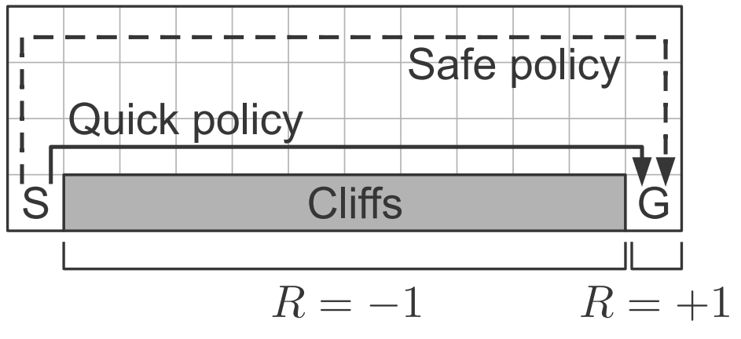
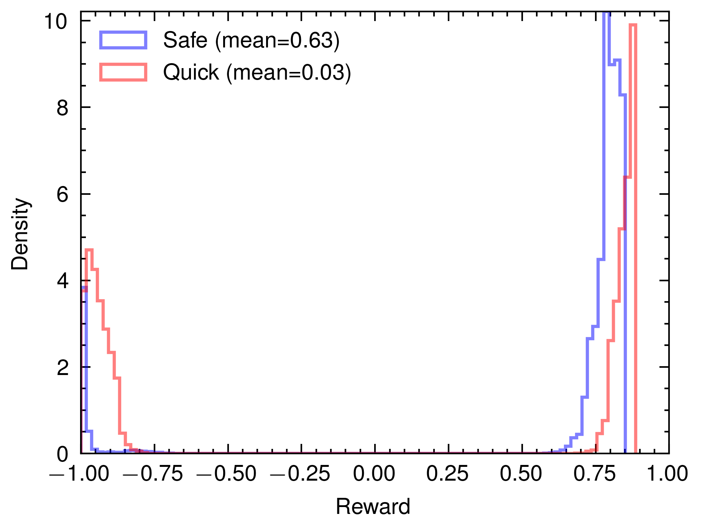

# Modified Cliffs of Moher Simulation

## Description 

1. State
    * Grid range is $(0,0)$ to $(11, 3)$
    * Start with cell "S" $(0,0)$
    * End with cell "G" $(11,0)$
    * Cliffs are located from $(1,0)$ to $(10,0)$ (terminal state)

2. Action
    * Four actions: Up, Down, Left, Right
    * There is a probability $p=0.25$ that the strong winds take the agent in a random direction

3. Reward
    * "G" cell : $+1$
    * Cliffs : $-1$
    * Other cell : $0$
    * Discount factor : $\gamma = 0.99$

4. Policies
    1. Safe policy: described in figure
    2. Quick policy: described in figure

## Pre-requisites

1. Rust
    * peroxide

2. Python
    * pandas
    * pyarrow
    * numpy
    * matplotlib
    * scienceplots

## Results

