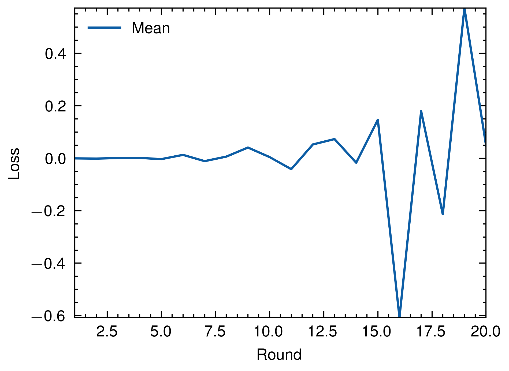
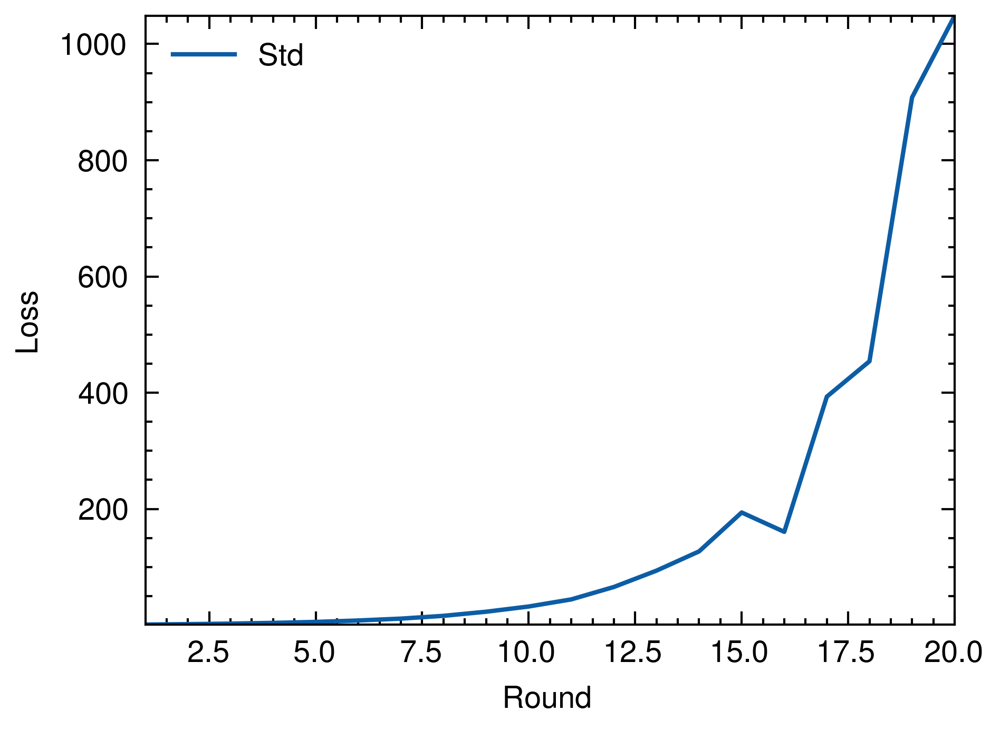
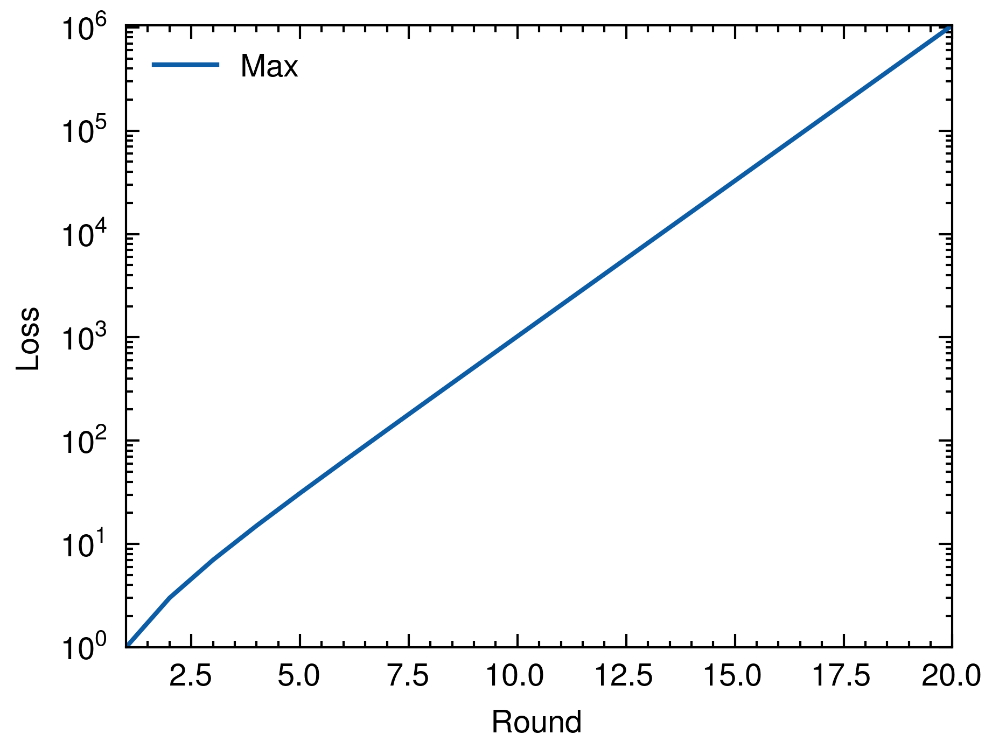

# Martingale Betting Strategy Simulation

This project contains Rust and Python code to simulate and visualize the Martingale betting strategy.

## Description

The Martingale betting system is a strategy in which the bettor doubles their bet after every loss, so that the first win would recover all previous losses plus win a profit equal to the original stake.

In this simulation, a fair coin toss is used as the betting event with each coin toss being an independent event.

The Rust code simulates the betting scenario 1,000,000 times for up to 20 rounds. It calculates the mean, standard deviation, and maximum of losses for each round and writes the data into a parquet file.

The Python code reads the generated parquet file, and creates three plots using Matplotlib: Mean, Standard Deviation, and Maximum of losses versus the number of rounds. 

## Dependencies

### Rust

* peroxide
* rayon
* indicatif

### Python

* pandas
* matplotlib
* scienceplots
* numpy

## Usage

### Simulating the Martingale strategy:

```bash
cargo run --release
```

This will create a file `martingale.parquet` containing the simulation results.

### Visualizing the simulation:

```bash
python pq_plot.py
```

This will read the data from `martingale.parquet` and create three plots: `martingale_mean.png`, `martingale_std.png`, and `martingale_max.png`.

## Results

The resulting plots show the Mean, Standard Deviation, and Maximum losses over time for the Martingale betting strategy.





These visualizations help us understand the Martingale betting strategy better. As the number of rounds increase, it becomes more likely that a player will suffer a large loss. It is important to remember that while the Martingale strategy may seem attractive due to its potential for short-term gains, it carries significant risk of large losses in the long term.
